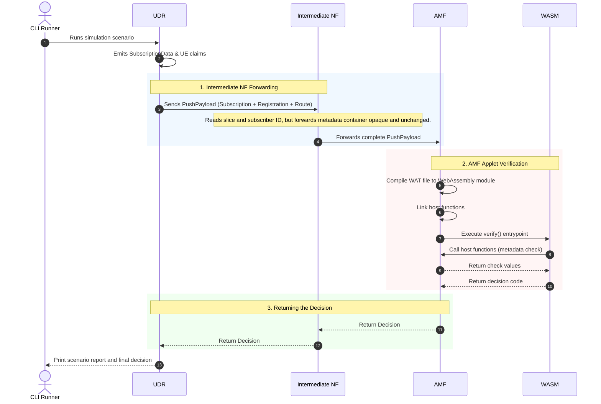

# Programmable Parameter Demo

This demo turns the proposal in `programmable-parameter.md` into runnable code.

It simulates three network functions:

- UDR emits subscription data.
- An intermediate NF forwards data it does not understand.
- AMF runs a hot-swappable WASM applet to verify AI-agent metadata.

## Running the Demo

The easiest way to run the entire simulation is using the provided orchestrator script:

```bash
./run_demo.sh
```

This will compile all binaries, start the `intermediate_nf` and `amf` servers in the background, run the UDR trigger client, print the results, and automatically clean up all background processes.

### Running manually in separate terminals

If you prefer to run the components manually:

1. **Terminal 1**: Start Intermediate NF (port 8082):
   ```bash
   cargo run --bin intermediate_nf
   ```
2. **Terminal 2**: Start AMF (port 8083):
   ```bash
   cargo run --bin amf
   ```
3. **Terminal 3**: Run the UDR client trigger:
   ```bash
   cargo run
   ```

The dynamic upgrade verification checks the AI agent ID, trust level, and vendor dynamic parameter, returning the authorization decision `ALLOW` if they match.

## Execution Flow

The sequence of events in the simulation when executing the dynamic upgrade scenario:


