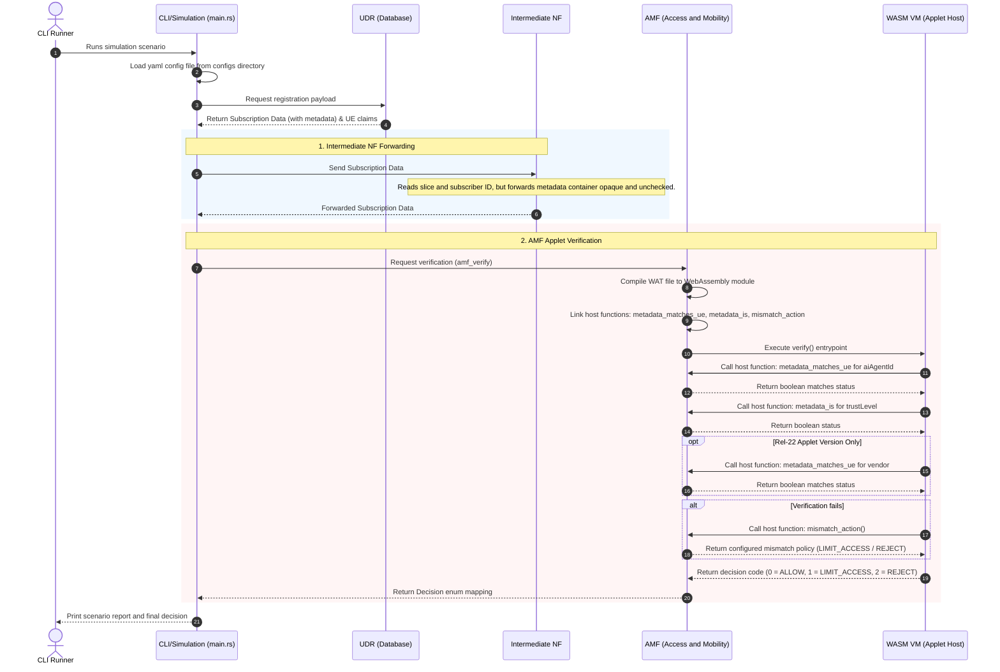

# Programmable Parameter Demo

This demo turns the proposal in `programmable-parameter.md` into runnable code.

It simulates three network functions:

- UDR emits subscription data.
- An intermediate NF forwards data it does not understand.
- AMF runs a hot-swappable WASM applet to verify AI-agent metadata.

Run:

```bash
cargo run -- --scenario rel22-vendor-pass --config configs/rel22.yaml
```

Useful scenarios:

```bash
cargo run -- --scenario strict-breaks
cargo run -- --scenario rel21-pass --config configs/rel21.yaml
cargo run -- --scenario rel22-vendor-pass --config configs/rel22.yaml
cargo run -- --scenario vendor-mismatch --config configs/rel22.yaml
```

The important contrast is:

- `strict-breaks`: a new inline parameter forces intermediate NF schema changes.
- `rel22-vendor-pass`: the same new parameter survives as metadata, and only AMF logic changes through a WASM applet.

## Execution Flow

The sequence of events in the simulation when executing a scenario:


