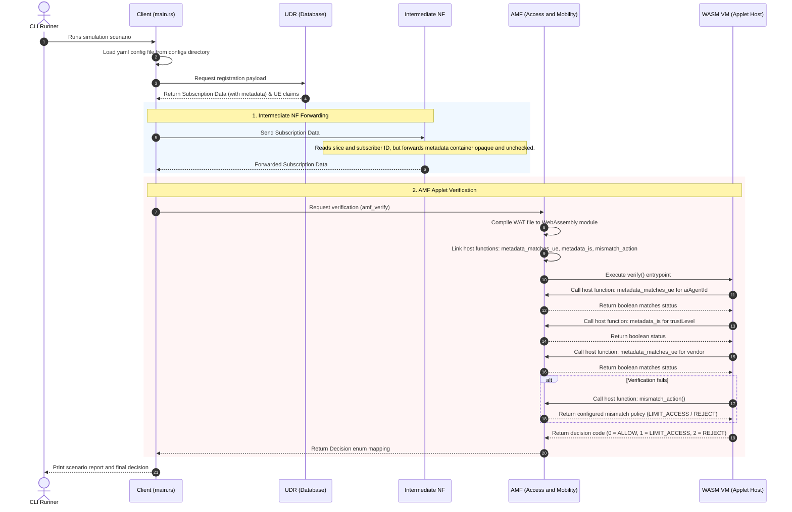

# Programmable Parameter Demo

This demo turns the proposal in `programmable-parameter.md` into runnable code.

It simulates three network functions:

- UDR emits subscription data.
- An intermediate NF forwards data it does not understand.
- AMF runs a hot-swappable WASM applet to verify AI-agent metadata.

## Running the Demo

Since Intermediate NF and AMF are independent background services, you should run them first, then trigger the flow via UDR:

### Step 1: Start the background services (in 2 separate terminals)

1. **Start Intermediate NF (port 8082)**:
   ```bash
   cargo run --bin intermediate_nf
   ```
2. **Start AMF (port 8083)**:
   ```bash
   cargo run --bin amf
   ```

### Step 2: Run the UDR Client Trigger

In a 3rd terminal, run the UDR database process to emit subscription data and trigger the flow:

```bash
cargo run -- --config configs/rel22.yaml
```

The dynamic upgrade verification checks the AI agent ID, trust level, and vendor dynamic parameter, returning the authorization decision `ALLOW` if they match.

## Execution Flow

The sequence of events in the simulation when executing the dynamic upgrade scenario:


